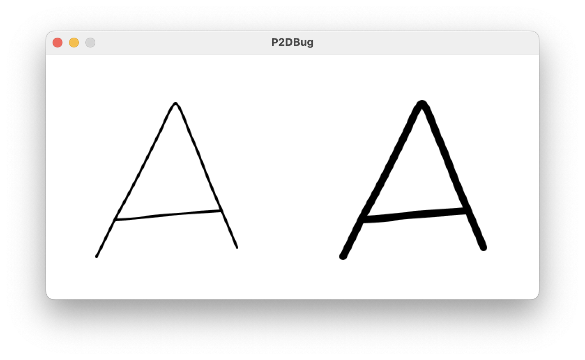
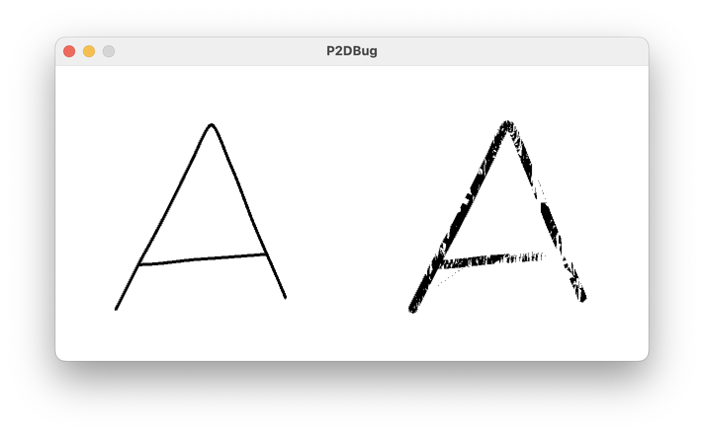

# SVG Rendering Bug in P2D

## Description

When drawing an SVG shape (with style disabled) using the P2D renderer, the rendering will glitch if the shape is drawn more than once with a different stroke weight.

## Repro Steps

Run the sketch in this repo or follow steps below:

1. Set up sketch with P2D renderer.
2. Load an SVG into a PShape and call `disableStyle()` on it.
3. Draw the shape to the screen once, then change `strokeWeight` and draw again.

### Expected Results

The shape should appear on the canvas twice, at different stroke weights.

Example drawn with default renderer:

### Actual Results

The first shape appears as expected. The second shape (drawn after changing `strokeWeight`) is drawn with a glitched stroke.

Example drawn with P2D renderer:

## Workarounds

-   Using the default renderer works as expected
-   Drawing the shape only once (with any stroke weight) works as expected
-   Drawing the shape multiple times without changing stroke weight works as expected
-   Loading the same SVG into a separate PShape instance to render as the second graphic works as expected
